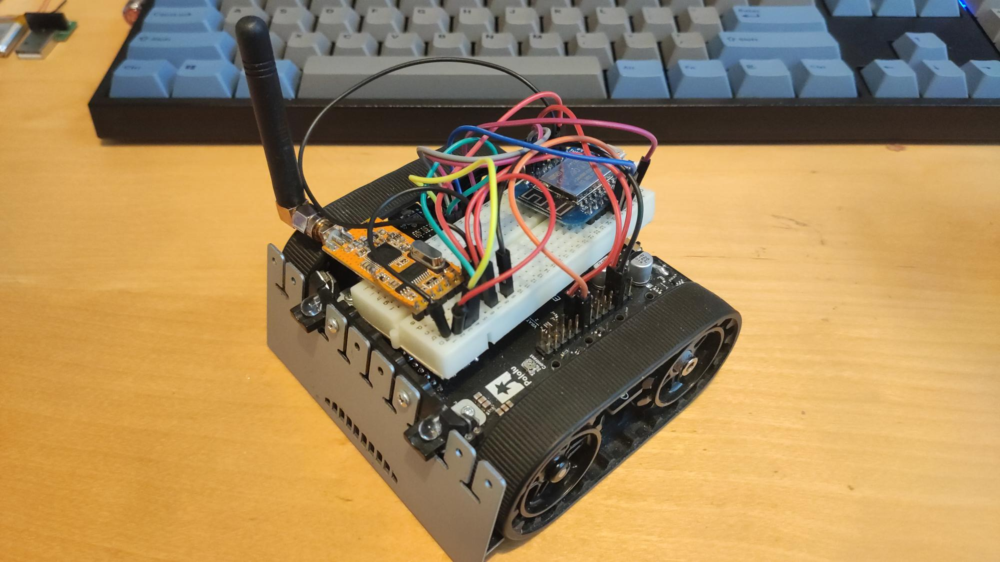

# The zumo xyz-project
This is the zumo project used for measuring IMU data with the Pololu zumo rover, or just have some plain old fun!

##Documentation
The zumo rover is extensively documented at <https://www.pololu.com/docs/0J63>.
- Pinout: <https://www.pololu.com/docs/0J63/3.10>
- Pinout diagram: <https://www.pololu.com/file/0J864/zumo-32u4-pinout.pdf>
## Sensors
The list of included sensors:
- Accelero and gyro: <https://www.pololu.com/file/0J1087/LSM6DS33.pdf>
- Magneto: <https://www.pololu.com/file/0J1089/LIS3MDL.pdf> 